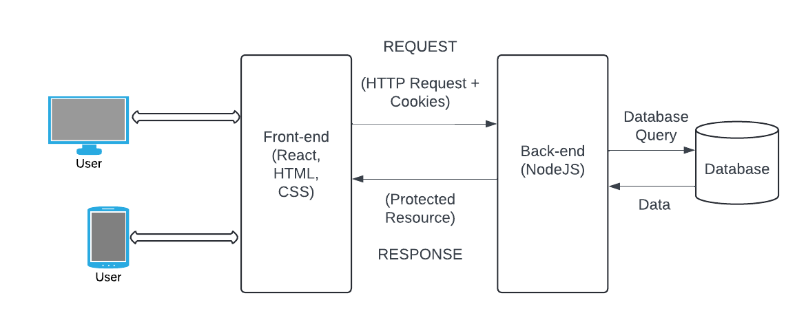

# Digital Donor Engagement: The Impact of Motivational Messages and AI-Created Content on Monetary Donations.

## Project Overview

This project investigates the effectiveness of motivational messages and AI-generated content in enhancing donor engagement and maximizing contributions on online fundraising platforms. It employs a data-driven approach to evaluate how these strategies influence donor behavior and decision-making.

The platform provides three variations of fundraising pages to assess engagement:
1. Fundraising pages with motivational messages.
2. Fundraising pages with AI-generated content.
3. Control pages with neither motivational messages nor AI content.

## Architecture Diagram
Below is the architecture diagram of the project:

## Key Features

- **Interactive Fundraising Pages**: Users can navigate multiple fundraising pages with various content strategies.
- **Points-Based Donation System**: Simulates donations using points, avoiding real monetary transactions.
- **Motivational Messaging**: Displays peer-generated motivational messages to increase engagement.
- **AI-Generated Content**: Integrates AI-crafted titles, images, and descriptions to evaluate their impact on trust and donations.

## Technology Stack

### Frontend:
- **React.js**: Component-based, responsive UI.
- **Redux**: State management for seamless data flow.
- **Axios**: HTTP client for API interactions.
- **Bootstrap**: Styling for a modern and responsive design.
- **Formik**: Simplifies form handling and validation.

### Backend:
- **Node.js** with **Express.js**: Handles API requests, user authentication, and data processing.
- **Sequelize ORM**: Simplifies interactions with the MySQL database.
- **JWT Authentication**: Ensures secure user sessions.

### Database:
- **MySQL**: Manages user data, donations, and survey results.

### Deployment:
- **Heroku**: Cloud hosting for the platform.
